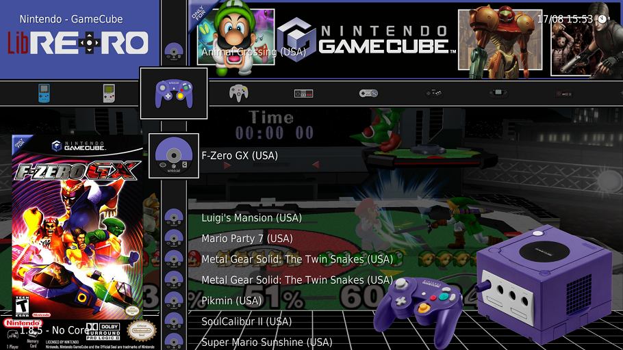

# RetroArch

My personal files and configuration for RetroArch. You just need to copy roms and RetroArch to it.

## Content

  1. [Install](#install)
  2. [Config](#configuration)
  3. [Usage](#usage)
  4. [Contribution](#contribution)
  5. [Resources](#resources)

---------------------------------------

## Install

- clone this repo into `D:\Games`
- unzip `RetroArch.zip` into `D:\Games\RetroArch`
- copy roms into `D:\Games\RetroArch\roms`
- copy Gamecube meme cards into `D:\Games\RetroArch\saves\User\GC`
- execute `D:\Games\RetroArch\retroarch.exe`
- Main Menu -> Online updater -> Core updater -> ...

### Cores

- Sony - Playstation 2
  - `RetroArch/core/pcsx2_libretro.dll`
  - `RetroArch/system/pcsx2/bios/SCPH-70004_BIOS_V12_EUR_200.BIN`
- Sony - Playstation/PSX
  - `RetroArch/core/pcsx_rearmed_libretro.dll`
  - `RetroArch/system/scph5500.bin, scph5501.bin, scph5502.bin`
- Nintendo - Game Cube, Wii 
  - `RetroArch/core/dolphin_libretro.dll`
- Nintendo - Nintendo 64
  - `RetroArch/core/mupen64plus_next_libretro.dll`
- Nintendo - SNES
  - `RetroArch/core/snes9x_libretro.dll`
- Nintendo - Game Boy, Game Boy Color, Game Boy Advance
  - `RetroArch/core/mgba_libretro.dll`
  - `RetroArch/system/gb_bios.bin, gbc_bios.bin, gba_bios.bin, sgb_bios.bin`
- Nintendo - NES
  - `RetroArch/core/nestopia_libretro.dll`
- Sega Dreamcast
  - `RetroArch/core/flycast_libretro.dll`
  - `RetroArch/system/dc/`[dc_boot.bin](https://archive.org/download/dc_boot)
  - `RetroArch/system/dc/awbios.zip, naomi.zip, naomi2.zip`
- Sega - Master System, Mega Drive/Genesis, 32X, Game Gear
  - `RetroArch/core/picodrive_libretro.dll`
  - `RetroArch/system/bios.sms`
  - `RetroArch/system/bios_CD_E.bin, bios_CD_J.bin, bios_CD_U.bin`
- Amstrad - CPC
  - `RetroArch/core/cap32_libretro.dll`
- Commodore - Amiga
  - `RetroArch/core/puae_libretro.dll`
  - `RetroArch/`[capsimg.dll](https://github.com/rsn8887/capsimg/releases)
  - `RetroArch/system/`[capsimg.dll](https://github.com/rsn8887/capsimg/releases)
  - `RetroArch/system/`[kick34005.A500](https://github.com/rsn8887/capsimg/releases) (bios)
- Arcade
  - `RetroArch/core/mame_libretro.dll`
  - `RetroArch/core/fbneo_libretro.dll`
    - `RetroArch/system/stvbios.zip` (bios)

## Configuration

Desktop Menu (F5) -> View -> Settings...

Settings -> Drivers:
- Menu: xmb
- ...restart RetroArch

Settings -> Input -> Hotkey Binds:
- Menu Toggle Gamepad Combo: "Start + Select"

Settings -> User Interface -> Menu Item Visibility -> Tabs
- Show Settings: OFF
- Show Images: OFF
- Show Music: OFF
- Show Video: OFF
- Show Netplay: OFF
- Show Import: OFF

Settings -> User Interface -> Appearance
- Shader Pipeline: OFF
- Color Theme: Background Image
- Background Image: D:\Games\RetroArch\assets\wallpapers\default,png
- Background opacity 90
- Dynamic Background: YES
- Icon Theme: Retro System
- Primary Thumbnails: OFF
- Left Thumbnails: Boxart

## Usage

- Toggle Desktop Menu: <kbd>F5</kbd>
- Toggle Menu: <kbd>F1</kbd> or <kbd>Start</kbd>+<kbd>Select</kbd>
- Speed up: <kbd>SPACE</kbd>
- Fullscreen: <kbd>F</kbd>
- DIsable Shader/Filter: <kbd>,</kbd>

## Shader by default

ex: CRT Royale

- start RetroArch...
- start a game...
- toggle menu (F1)
  - Shaders
    - Video Shaders: ON
    - Load Preset -> `shaders_slang/crt/crt-royale.slangp`
    - Save Preset -> Save Global Preset

## Shaders

- Default: `crt-lottes`
- Nintendo - Game Boy
  - Core options -> Video -> Palette -> DMG Green
  - Shaders -> Load Preset -> `shaders_slang/handheld/console-border/dmg.slangp`-> Save Content Directory Preset
- Nintendo - Game Boy Color
  - Shaders -> Load Preset -> `shaders_slang/handheld/console-border/gbc-lcd-grid-v2.slangp`-> Save Content Directory Preset
- Nintendo - Game Boy Advance
  - Shaders -> Load Preset -> `shaders_slang/handheld/console-border/gba.slangp`-> Save Content Directory Preset
- Sega - Game Gear
  - Shaders -> Load Preset -> `shaders_slang/handheld/console-border/gg.slangp`-> Save Content Directory Preset

---

## Contribution

### Wallpapers for Kdeizy

follow up of [Dynamic Wallpapers. Google link in comments. (Reddit)](https://www.reddit.com/r/RetroArch/comments/mz1zq0/dynamic_wallpapers_google_link_in_comments/)

## FAQ

Why not Atari-ST ? 
- Because Amiga has better sound.

Why not console arcade ports ?
- Because original Arcade system looks better.

Why no system after year 2000 ?
- Beacuse files take up too much space

---

## Resources

- roms
  - http://www.gametronik.com/
  - http://www.planetemu.net/
    - http://www.planetemu.net/roms/mame-roms
  - https://www.emulatorgames.net/
- RetroArch
  - https://github.com/libretro/libretro-database/tree/master/dat
  - https://github.com/libretro/libretro-database/tree/master/metadat/mame
  - https://github.com/libretro/libretro-database/tree/master/metadat/fbneo-split
  - https://github.com/libretro/fbalpha/tree/master/dats
- bios
  - https://edgeemu.net/browse-mame-S.htm
  - https://archive.org/download/aristmk6_201810
- boards infos
  - https://www.system16.com/
- Amiga
  - sound effects
    - https://github.com/libretro/libretro-uae
  - kickstart roms
    - https://www.ikod.se/download/
